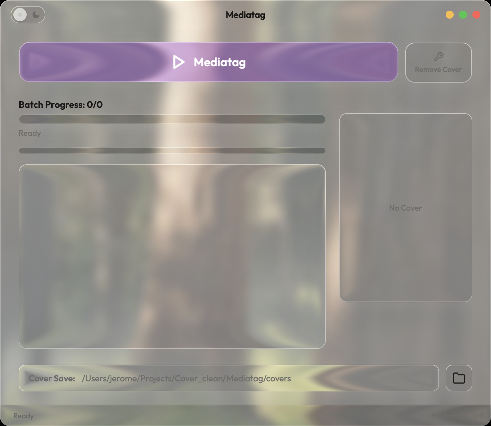
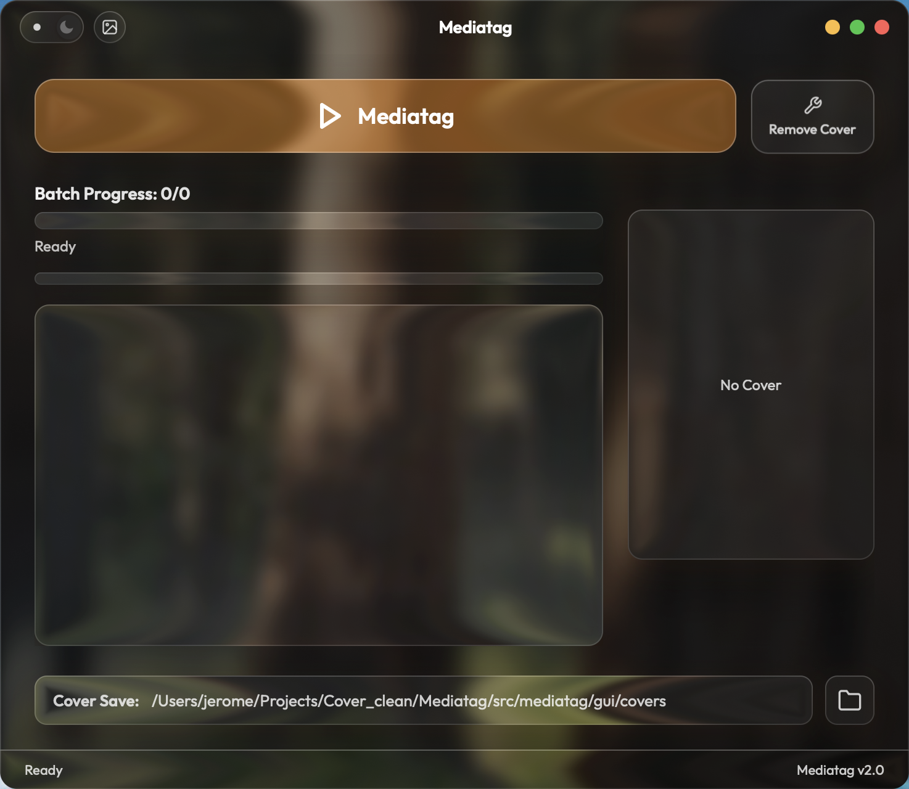

# liquid-glass

<p align="center">
  <strong>给任何 Web 桌面应用换上真·液态玻璃外壳的 AI Agent Skill。</strong><br>
  <em>An AI agent skill that gives any web-based desktop UI a true Apple-style liquid glass shell.</em>
</p>

> 本文档中文优先，English follows in each major section.

---

## 这是什么 / What It Is

**中文** - 这是一个可安装的 Agent Skill（兼容 Claude Code、Codex 等读取 `SKILL.md` 的编码代理），把一套经过实战验证的液态玻璃 UI 方案沉淀成"文档 + 成品脚本"。装上它之后，对你的 AI 编码助手说一句"把这个应用做成液态玻璃"，它就会按这套配方接线，而不是从零重新发明（并重新踩坑）。

**EN** - An installable agent skill (for Claude Code, Codex, and any coding agent that reads `SKILL.md`) that packages a battle-tested liquid glass UI recipe as docs + drop-in scripts. Install it, tell your AI coding assistant "make this app liquid glass", and it wires up the proven pipeline instead of reinventing (and re-tripping over) everything.

参考实现 / Reference implementation: **[Mediatag](https://github.com/Na2H2P2O7/Mediatag)**

---

## 演示 / Demo

https://github.com/user-attachments/assets/80251fee-ad9c-40cb-9aee-774ffaf111c7

> 🎬 拖动窗口时折射实时跟随、按压玻璃形变、实时屏幕背景、自适应文字（48s，[本地文件](show/demo-v2.mp4)）。/ Refraction tracking window drags, pressed-glass deformation, live screen backdrop, adaptive text ink.

| Light Mode | Dark Mode |
|:---:|:---:|
|  |  |

> 截图里窗口后面的森林就是真实的桌面壁纸——窗口是透明的，玻璃在真实地折射它。/ The forest behind the window is the actual desktop wallpaper — the window is transparent and the glass genuinely refracts it.

---

## 效果 / What You Get

**中文**

- 🪟 **真透明窗口 + 真折射** - 整个窗口是一块 WebGL 渲染的圆角霜面玻璃，UI 面板是其上更清透的"透镜"层，边缘真实弯曲窗口背后的桌面壁纸——不是 `backdrop-filter` 模拟。
- 📺 **实时屏幕背景** - 可切换到 ~7fps below-window 屏幕捕捉，折射窗口背后的一切（其它应用、视频、滚动网页）。
- 👆 **按压玻璃形变** - 光标如指尖按压玻璃，指针下方折射局部加深，按下更深、松开回弹——是折射管线本身的调制。
- 🔤 **自适应文字墨水** - 每个文字元素按其背后实际渲染亮度独立切换深/浅色，带滞回防抖。
- ⚡️ **空闲 0% CPU** - 渲染循环无事时完全停车。

**EN**

- 🪟 **True transparency + true refraction** - The whole window is one WebGL-rendered sheet of frosted glass; UI panels are clearer lens layers whose edges genuinely *bend* the desktop wallpaper behind the window — not a `backdrop-filter` imitation.
- 📺 **Live screen backdrop** - Optional ~7fps below-window capture: the glass refracts everything behind the window (other apps, video, scrolling pages).
- 👆 **Pressed-glass deformation** - The pointer presses the pane like a fingertip, locally deepening the refraction; deeper on mouse-down, relaxing on release — a modulation of the refraction pipeline itself.
- 🔤 **Adaptive text ink** - Every label independently flips between dark and light based on the actual rendered glass luminance behind it, with hysteresis.
- ⚡️ **0% idle CPU** - The render loop fully parks when nothing changes.

---

## 内容 / What's Inside

```
liquid-glass/
├── SKILL.md                    # Agent 的工作流入口 / agent workflow entry
├── assets/
│   ├── glass.js                # 完整 WebGL 渲染器，拖进项目即用 / complete drop-in renderer
│   └── glass_backdrop.py       # pywebview 后端：壁纸/实时捕捉/窗口同步 / backend mixin
└── references/
    ├── integration.md          # 接线指南 + 调参表 / wiring guide + tuning table
    └── pitfalls.md             # 踩坑实录（含为什么）/ hard-won traps, with the whys
```

两个 `assets` 是即插即用的成品；`references` 记录了 fp16 精度波纹、模糊鬼影、原生全屏杀透明度等每一个真实踩过的坑。

Both assets are finished, drop-in artifacts; the references document every trap actually hit — fp16 ripple artifacts, blur ghosting, native fullscreen killing transparency, and more.

---

## 安装 / Install

```bash
git clone https://github.com/Na2H2P2O7/liquid-glass-skill.git liquid-glass

# Claude Code
ln -s "$(pwd)/liquid-glass" ~/.claude/skills/liquid-glass

# Codex
ln -s "$(pwd)/liquid-glass" ~/.codex/skills/liquid-glass
```

然后对你的编码代理说 / then tell your coding agent:

> "给这个 pywebview 应用做一套液态玻璃 UI" / "Give this pywebview app a liquid glass UI"

---

## 不用 Agent 也能用 / Using It Without an Agent

`assets/` 里的两个文件可以直接手动集成——按 `references/integration.md` 的步骤：HTML 元素标 `data-glass` 属性、body 透明、Python 侧继承 `GlassBackdrop` mixin，三步接通。浏览器纯网页项目也可用（传任意图片作折射源）。

The two files in `assets/` integrate by hand too — follow `references/integration.md`: tag elements with `data-glass`, make the body transparent, mix `GlassBackdrop` into your pywebview api class. Plain web pages work as well (feed any image as the refraction source).

**Requirements**: pywebview ≥ 5, Pillow (desktop path); macOS for window transparency & live capture (Windows draws the same refraction in an opaque window). The renderer itself is plain WebGL 1 — any modern web view.

---

## 许可证 / License

MIT
